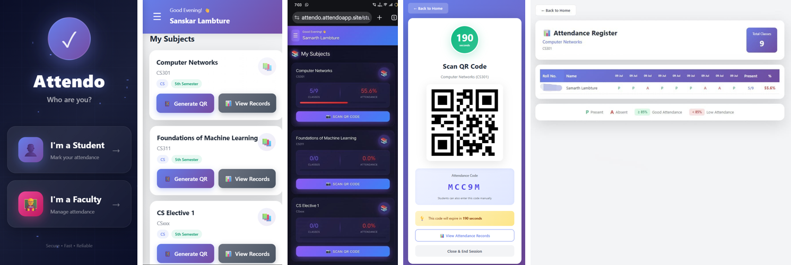
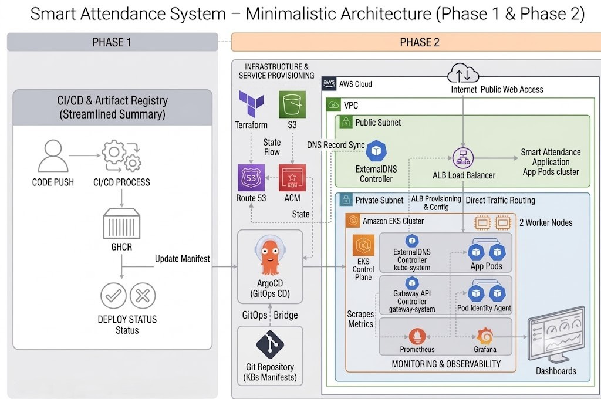
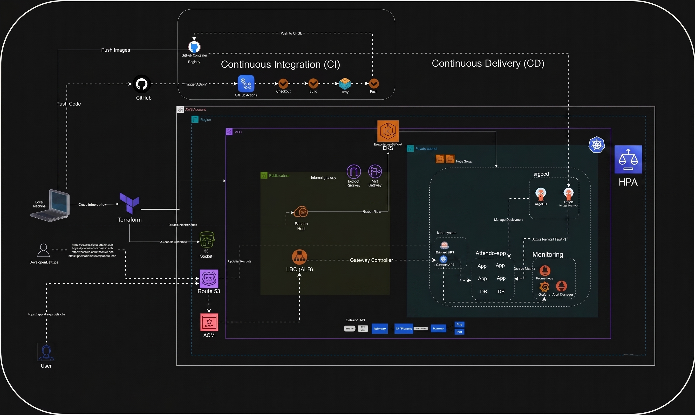
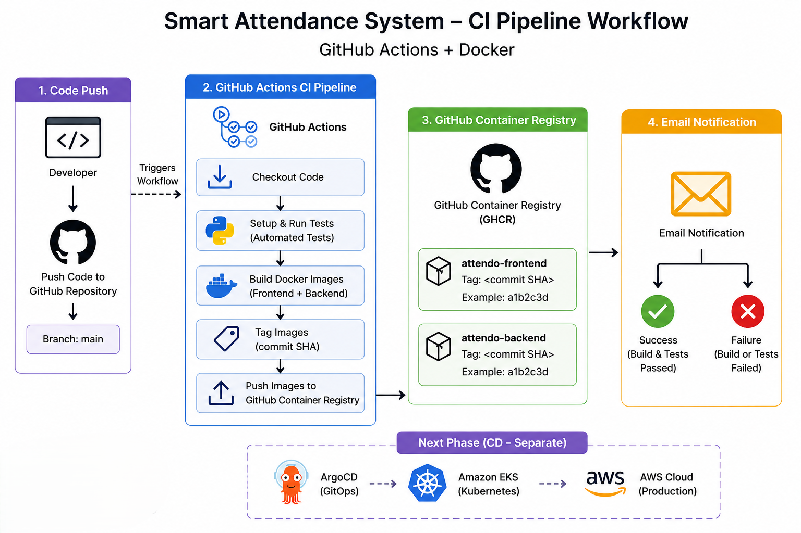
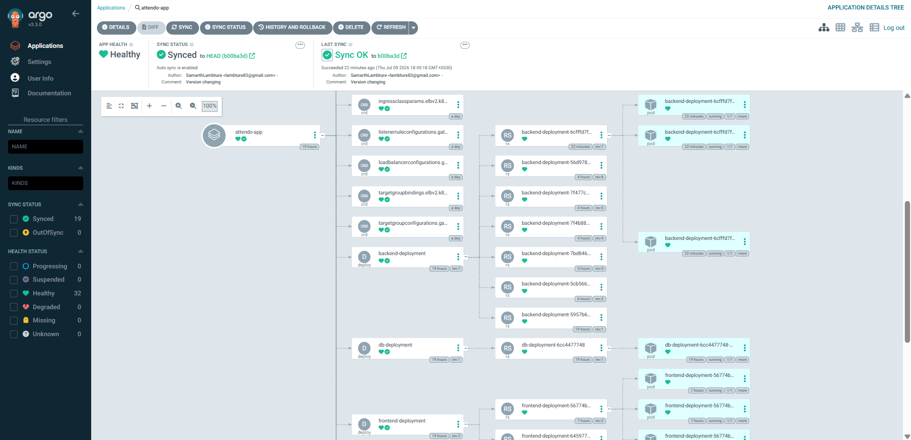
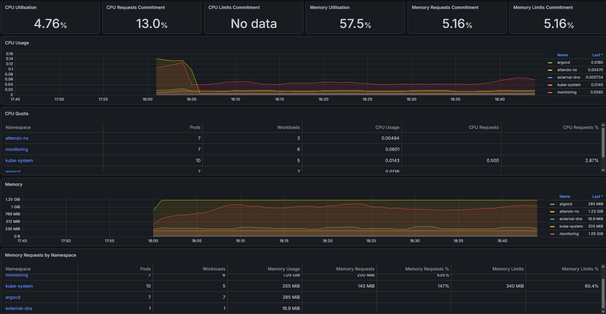
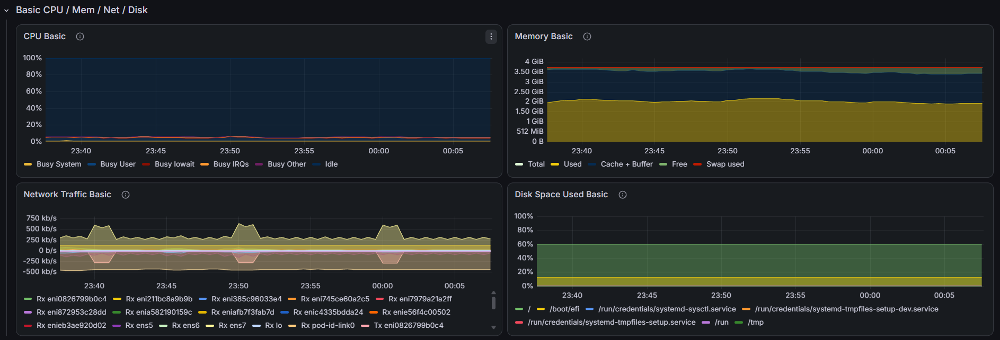

<div align="center">

# 🎓 Attendo — Smart Attendance System

### Killing proxy attendance with QR codes, live face recognition, and a production-grade DevOps pipeline.

[](#-tech-stack)
[](#-tech-stack)
[](#-tech-stack)
[](#-tech-stack)
[](#-devops--infrastructure)
[](#-devops--infrastructure)
[](#-devops--infrastructure)
[](#-devops--infrastructure)
[](#-devops--infrastructure)
[](#-license)

</div>

<p align="center">
  
</p>

<p align="center">
  <i>Faculty generates a time-boxed QR → student scans it and takes a live selfie → the backend verifies the face and marks attendance. No proxies, no paperwork.</i>
</p>

---

## 📌 Table of Contents

- [The Problem](#-the-problem)
- [What Attendo Does](#-what-attendo-does)
- [App Walkthrough](#-app-walkthrough)
- [Tech Stack](#-tech-stack)
- [System Architecture](#-system-architecture)
- [DevOps & Infrastructure](#-devops--infrastructure)
  - [Phase 1 — Containerization & CI](#phase-1--containerization--ci-github-actions)
  - [Phase 2 — Cloud-Native Deployment on AWS](#phase-2--cloud-native-deployment-on-aws)
- [Observability](#-observability)
- [Getting Started](#-getting-started)
- [Deployment Guide](#-deployment-guide)
- [Cleanup](#-cleanup)
- [Roadmap](#-roadmap)
- [License](#-license)

---

## 🎯 The Problem

Proxy attendance is a decades-old problem on college campuses — one student signs in for several friends, and attendance registers stop meaning anything. **Attendo** was built to close that loophole using two things a proxy can't fake: a **short-lived QR code** and the **student's own face**, captured live.

## ✨ What Attendo Does

| Feature | Description |
|---|---|
| ⏱️ **Time-boxed QR codes** | Faculty generates a QR code valid for only **5 minutes** per session |
| 🤳 **Live selfie only** | Students must capture a live photo to check in — gallery uploads are blocked |
| 🧠 **Face-embedding match** | The backend compares face embeddings and only marks attendance on a confident match |
| 🔒 **Privacy by design** | Only face **embeddings** are stored — never the raw photos |
| 📊 **Dual dashboards** | Separate student and faculty views with attendance analytics and percentage tracking |
| 🔁 **Fallback code entry** | Students can also key in the attendance code manually if scanning fails |

## 📱 App Walkthrough

<table>
<tr>
<td width="50%">

**Faculty side**
1. Register with Faculty ID, department & designation
2. Pick a subject → **Generate QR** — live 5-minute countdown + a fallback alphanumeric code
3. Track attendance in a live register with per-student percentages

</td>
<td width="50%">

**Student side**
1. Register with roll number, branch, semester & a live face capture
2. Scan the QR (or enter the code) for the current class
3. Take a live selfie → attendance is verified and marked instantly, with running % shown per subject

</td>
</tr>
</table>

> Every scan, selfie, and match runs through the same face-embedding pipeline — so the record on the faculty's side and the percentage the student sees always agree.

---

## 🛠 Tech Stack

| Layer | Technology |
|---|---|
| **Frontend** | React + Vite |
| **Backend** | FastAPI (Python) |
| **Database** | PostgreSQL |
| **Face Recognition** | InsightFace (face embeddings, not raw images) |
| **Containerization** | Docker (multi-stage builds) |
| **CI** | GitHub Actions → GitHub Container Registry (GHCR) |
| **CD** | ArgoCD (GitOps) |
| **Infrastructure as Code** | Terraform |
| **Orchestration** | Amazon EKS (Kubernetes) |
| **Networking** | Application Load Balancer, Gateway API, ExternalDNS, Route 53, ACM |
| **Monitoring** | Prometheus + Grafana |

## 🏗 System Architecture

<p align="center">
  
</p>

The system runs as two containerized services (frontend + backend) behind an AWS Application Load Balancer, deployed into a private-subnet EKS cluster, with GitOps-driven delivery and full observability:

<p align="center">
  
</p>

**Request flow:** `User → Route 53 → ALB → Gateway API → EKS (frontend & backend pods) → PostgreSQL`
**Delivery flow:** `Code Push → GitHub Actions (build, test, push image to GHCR) → ArgoCD detects the new manifest → syncs to EKS`

---

## 🚀 DevOps & Infrastructure

Attendo didn't stop at "it works on my machine." It was taken through two deliberate phases to make it production-ready.

### Phase 1 — Containerization & CI (GitHub Actions)

After the core app was working, the next goal was making every change **automatically built, tested, and validated.**

**What was implemented:**
- ✅ Multi-stage Dockerfiles for both the frontend (Vite) and backend (FastAPI), with a tuned `.dockerignore` for lean images
- ✅ A GitHub Actions CI workflow that, on every push to `main`:
  - Checks out the code and runs automated tests
  - Builds the Docker images
  - Tags images with the commit SHA
  - Pushes them to **GitHub Container Registry (GHCR)**
  - Sends an email notification on success or failure

<p align="center">
  
</p>

> **Note:** Continuous Deployment is handled separately via **ArgoCD (GitOps)** — covered in Phase 2.

### Phase 2 — Cloud-Native Deployment on AWS

With CI in place, the next step was deploying Attendo on **production-style AWS infrastructure**, covering Infrastructure as Code, Kubernetes orchestration, GitOps, and monitoring.

**Infrastructure (Terraform):**
- VPC with public & private subnets, and security groups
- Bastion Host (EC2) for secure, controlled cluster access
- Amazon **EKS** cluster running in private subnets with managed node groups
- Application Load Balancer (ALB) + Gateway API + ExternalDNS for automated domain management

**Kubernetes & GitOps:**
- Kubernetes Deployments & Services for both frontend and backend
- **ArgoCD** for automated, Git-driven continuous deployment

<p align="center">
  
</p>

**Monitoring:**
- **Prometheus** for metrics collection
- **Grafana** for dashboards and visualization

<p align="center">
  
</p>

---

## 📈 Observability

Deliberately kept **outside** ArgoCD — anyone with ArgoCD access could otherwise modify the monitoring stack, so it's managed independently via Helm.

- **`kube-prometheus-stack`** for metrics (CPU, memory, network, disk — cluster- and pod-level)
- **Grafana**, exposed through its own `HTTPRoute` + `TargetGroupBinding`, for dashboards

<p align="center">
  
</p>

---

## ⚡ Getting Started

### Prerequisites
- An **AWS Free Tier** account
- A **registered domain** for the app (you'll point it at the ALB and issue your own ACM certificate)
- AWS CLI and Terraform installed locally
- An IAM user with an access key / secret key, configured via `aws configure`

### Clone & Configure

```bash
git clone https://github.com/SamarthLambture/Smart-Attendance-System.git
cd Smart-Attendance-System
```

> ⚠️ Don't forget to create your own `.env` file with your credentials, and a `secrets.yml` in the `k8s-manifest` folder before deploying.

### Provision the Infrastructure

```bash
cd Smart-Attendance-System/terraform
terraform init
terraform plan
terraform apply
```

`terraform apply` outputs the Bastion Host's public IP, and writes its private key to the current directory.

<details>
<summary><b>Optional — set up a remote Terraform backend (S3)</b></summary>

```bash
aws s3api create-bucket \
  --bucket devopsdock-terraform-backend-bucket \
  --region us-east-1

# Enable versioning
aws s3api put-bucket-versioning \
  --bucket devopsdock-terraform-backend-bucket \
  --versioning-configuration Status=Enabled

# Enable encryption
aws s3api put-bucket-encryption \
  --bucket devopsdock-terraform-backend-bucket \
  --server-side-encryption-configuration '{
    "Rules":[{
      "ApplyServerSideEncryptionByDefault":{
        "SSEAlgorithm":"AES256"
      }
    }]
  }'
```
</details>

---

## 🌐 Deployment Guide

<details>
<summary><b>1. Connect to the Bastion Host & install cluster tools</b></summary>

```bash
ssh -i bastion-key.pem ubuntu@<publicIP>
```

Install on the Bastion Host: **AWS CLI**, **kubectl**, **Helm**, **eksctl**.

```bash
aws configure   # use the same access/secret key as your local setup
aws eks update-kubeconfig --region <your-region> --name <your-cluster-name>
kubectl get nodes
```
</details>

<details>
<summary><b>2. Install the AWS Load Balancer Controller</b></summary>

```bash
eksctl utils associate-iam-oidc-provider \
  --region <region-code> \
  --cluster <your-cluster-name> \
  --approve

curl -O https://raw.githubusercontent.com/kubernetes-sigs/aws-load-balancer-controller/v2.14.1/docs/install/iam_policy.json

aws iam create-policy \
  --policy-name AWSLoadBalancerControllerIAMPolicy \
  --policy-document file://iam_policy.json

eksctl create iamserviceaccount \
  --cluster=<cluster-name> \
  --namespace=kube-system \
  --name=aws-load-balancer-controller \
  --attach-policy-arn=arn:aws:iam::<AWS_ACCOUNT_ID>:policy/AWSLoadBalancerControllerIAMPolicy \
  --override-existing-serviceaccounts \
  --region <aws-region-code> \
  --approve

helm repo add eks https://aws.github.io/eks-charts
helm repo update eks

helm upgrade -i aws-load-balancer-controller eks/aws-load-balancer-controller \
  -n kube-system \
  --set clusterName=<cluster-name> \
  --set region=<region> \
  --set vpcId=<vpc-id> \
  --set serviceAccount.create=false \
  --set serviceAccount.name=aws-load-balancer-controller \
  --set controllerConfig.featureGates.NLBGatewayAPI=true \
  --set controllerConfig.featureGates.ALBGatewayAPI=true \
  --version 3.0.0

kubectl get deployment -n kube-system aws-load-balancer-controller
```
</details>

<details>
<summary><b>3. Install the Gateway API CRDs</b></summary>

```bash
kubectl apply -f https://github.com/kubernetes-sigs/gateway-api/releases/download/v1.3.0/standard-install.yaml
kubectl apply -f https://github.com/kubernetes-sigs/gateway-api/releases/download/v1.3.0/experimental-install.yaml
kubectl apply -f https://raw.githubusercontent.com/kubernetes-sigs/aws-load-balancer-controller/refs/heads/main/config/crd/gateway/gateway-crds.yaml
```
</details>

<details>
<summary><b>4. Deploy ExternalDNS (via Pod Identity)</b></summary>

```bash
# IAM policy for Route 53 access — see policy.json in /docs
aws iam create-policy --policy-name "AllowExternalDNSUpdates" --policy-document file://policy.json

export POLICY_ARN=$(aws iam list-policies \
  --query 'Policies[?PolicyName==`AllowExternalDNSUpdates`].Arn' --output text)
export EKS_CLUSTER_NAME=<your-cluster-name>

kubectl create ns external-dns

eksctl create podidentityassociation \
  --cluster $EKS_CLUSTER_NAME \
  --namespace external-dns \
  --service-account-name external-dns \
  --role-name external-dns-pod-identity-role \
  --permission-policy-arns $POLICY_ARN

helm repo add external-dns https://kubernetes-sigs.github.io/external-dns/
helm install external-dns external-dns/external-dns -n external-dns --version 1.20.0

kubectl get pod -n external-dns
```
</details>

<details>
<summary><b>5. Deploy ArgoCD</b></summary>

```bash
helm repo add argo https://argoproj.github.io/argo-helm
helm show values argo/argo-cd --version 9.4.0 > argocd-values-9.4.0.yaml
# edit: server.insecure=true, configs.cm.kustomize.buildOptions="--enable-helm",
#       and the HTTPRoute block for your ArgoCD hostname

helm install argo-cd argo/argo-cd -n argocd -f argocd-values-9.4.0.yaml --version 9.4.0 --create-namespace
kubectl apply -f target-grp-config.yaml
kubectl apply -f attendo-app.yaml
```

**Why route + Helm this way:** the Helm chart stays reusable and publishable as-is; environment-specific pieces (`HTTPRoute`, `TargetGroupBinding`) live outside it as plain manifests. **Helm = application, extra manifests = platform/networking layer** — clean separation of concerns for GitOps.
</details>

<details>
<summary><b>6. Set up monitoring (Prometheus + Grafana)</b></summary>

```bash
kubectl create ns monitoring

helm repo add prometheus-community https://prometheus-community.github.io/helm-charts
helm show values prometheus-community/kube-prometheus-stack --version 81.6.3 \
  > observability/helm-values/kube-prom-stack-81.6.3.yaml

kubectl apply -f HTTProute-grafana.yaml
kubectl apply -f target-grp-grafana.yaml
```
</details>

---

## 🧹 Cleanup

```bash
# 1. Delete the Load Balancer and its security groups first, via the AWS Console

# 2. Then, from the machine where you originally ran terraform:
terraform destroy -auto-approve
```

---

## 🗺 Roadmap

- [x] Core attendance app — QR + live face verification
- [x] Dockerized frontend & backend
- [x] CI pipeline with GitHub Actions → GHCR
- [x] Terraform-provisioned AWS infrastructure (VPC, EKS, ALB, Bastion)
- [x] GitOps delivery with ArgoCD
- [x] Monitoring with Prometheus & Grafana
- [ ] Centralized logging (ECK stack)
- [x] Horizontal Pod Autoscaling under load
- [ ] Slack alerting for CI/CD and cluster events

---

## 📄 License

This project is licensed under the **MIT License** — see the [LICENSE](LICENSE) file for details.

---

<div align="center">
If this project helped you or you found it interesting, consider giving it a ⭐
 
---
 
### *"No proxies. No paperwork. Just real faces, real time, real attendance."*
 
**Created with ❤️ by [Samarth Lambture](https://github.com/SamarthLambture)**
 
[](https://github.com/SamarthLambture)
[](https://www.linkedin.com/in/samarth-lambture-1b5418338/)
 
</div>
